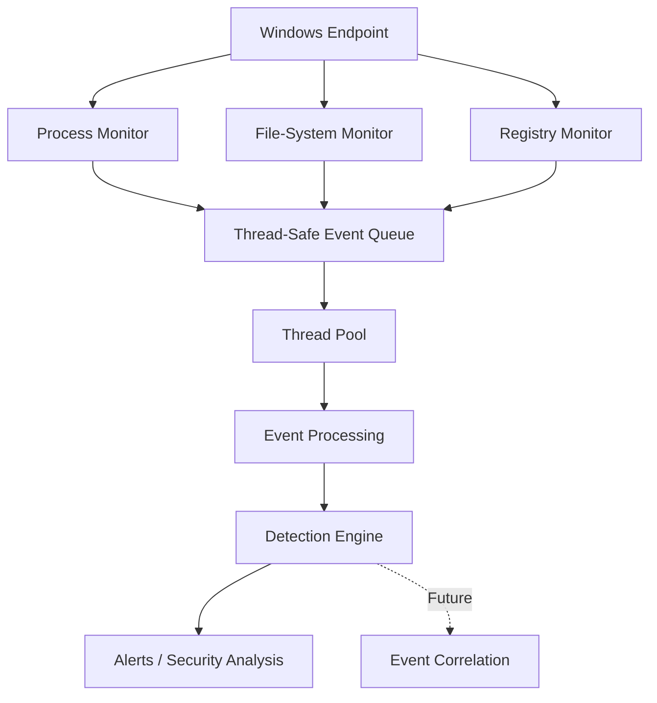
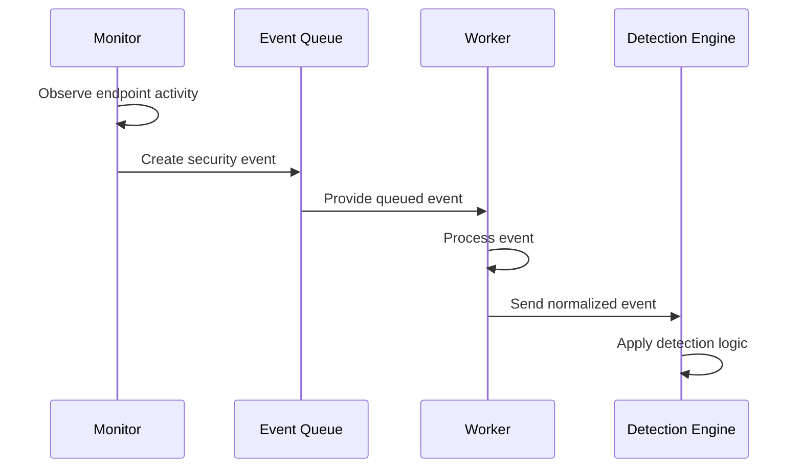

# KIG

<p align="center">
  <strong>Windows Endpoint Detection & Response System</strong><br>
  A C++ systems-security project focused on endpoint telemetry, monitoring, concurrency, and event-driven detection.
</p>

<p align="center">
  
  
  
  
</p>

<p align="center">
  
  
  
</p>

---

## About the Project

**KIG** is a Windows Endpoint Detection and Response (EDR) system I am building in C++.

The project started from a desire to understand how endpoint security software works beneath the surface. Instead of relying only on high-level security frameworks, KIG is being developed around Windows APIs, processes, threads, file-system activity, registry changes, concurrency, and security-event processing.

The current implementation focuses on building the **telemetry layer** of the EDR: observing endpoint activity, converting changes into events, and moving those events through a concurrent processing architecture.

The long-term goal is to build a modular security platform capable of collecting endpoint telemetry and applying detection logic to identify suspicious behavior.

---

## Current Capabilities

| Component | Status | Description |
|---|:---:|---|
| Process Monitor | ✅ | Monitors process-related activity on Windows |
| File-System Monitor | ✅ | Monitors file-system changes |
| Registry Monitor | 🚧 | Snapshot/change-comparison monitoring is under development |
| Thread Pool | ✅ | Provides reusable worker threads for concurrent processing |
| Thread-Safe Queues | ✅ | Safely move work/events between concurrent components |
| Event Processing | 🚧 | Processing pipeline is being expanded |
| Detection Engine | 🚧 | Event-focused detection architecture is under development |
| Process Injection Detection | 📋 | Research completed; dedicated detector is future work |
| Network Monitor | 📋 | Planned |
| Service Monitor | 📋 | Planned |
| DLL/Image-Load Monitor | 📋 | Planned |
| Kernel/Driver Monitoring | 📋 | Planned |

**Legend:**  
✅ Implemented / actively used  
🚧 In development  
📋 Planned

> The status table reflects the current development stage and intentionally separates implemented functionality from future work.

---

# Architecture

KIG is being designed as a modular pipeline.

Each monitor is responsible for collecting a specific type of endpoint telemetry. Events can then be passed through thread-safe queues to worker threads for processing and, eventually, detection.



### Design principle

The monitoring layer should **observe and produce telemetry**, while processing and detection should be separate responsibilities.

This makes the system easier to extend.

For example, a future network monitor can be added without requiring the existing process monitor to be redesigned:

```text
                    KIG Core
                         |
       +-----------------+------------------+
       |                 |                  |
       v                 v                  v
 Process Monitor   File Monitor      Registry Monitor
       |                 |                  |
       +-----------------+------------------+
                         |
                         v
                Event Queue(s)
                         |
                         v
                   Thread Pool
                         |
                         v
                 Event Processing
                         |
                         v
                 Detection Engine
```

---

# Event Pipeline

The intended event flow is:



For example:

```text
A process starts
      ↓
Process Monitor observes activity
      ↓
Process event is created
      ↓
Event enters thread-safe queue
      ↓
Worker thread processes event
      ↓
Detection logic evaluates event
      ↓
Potential alert / analysis result
```

---

# Monitoring Components

## 1. Process Monitoring

Process monitoring is one of the core telemetry sources in KIG.

The monitor provides visibility into process-related activity and creates a foundation for detecting suspicious execution behavior.

The work on process monitoring has also supported deeper study of:

- Windows process lifecycle
- Process handles
- Process memory
- Windows API interaction
- Process information
- User-mode security monitoring

### Why process telemetry matters

Many endpoint attacks involve processes. A useful EDR therefore needs to know which processes are executing and what other activity is associated with them.

Future process detections can build on this telemetry to identify behavior such as unusual parent/child relationships, suspicious memory operations, or other indicators.

---

## 2. File-System Monitoring

File-system monitoring is a major part of the current KIG development phase.

The monitor observes file-system changes and turns those changes into endpoint events.

The current monitoring model is intended to provide visibility into:

- File creation
- File modification
- File deletion
- File-system changes
- Activity within monitored locations

A simplified flow is:

```text
File-System Activity
        ↓
File Monitor
        ↓
Change/Event Information
        ↓
Thread-Safe Queue
        ↓
Event Processing
```

This telemetry can later support detections involving suspicious file activity.

---

## 3. Registry Monitoring

Registry monitoring is currently being developed as an additional telemetry source.

The current design uses a monitoring loop and registry snapshots to identify changes between states.

Conceptually:

```text
Previous Registry State
          ↓
      Monitor
          ↓
Current Registry State
          ↓
   Compare Snapshots
          ↓
     Detect Changes
          ↓
      Create Event
```

The implementation also uses Windows event objects to support controlled monitoring and shutdown.

Registry telemetry can eventually support detections involving suspicious configuration or persistence-related changes.

---

# Concurrency Architecture

EDR monitoring is naturally concurrent because multiple types of endpoint activity can occur at the same time.

KIG therefore uses C++ concurrency concepts including:

- Threads
- Thread pools
- Thread-safe queues
- Producer-consumer patterns
- Synchronization
- Mutexes
- Condition variables
- Controlled thread lifecycle

A simplified producer-consumer model is:

```text
             +------------------+
             | Process Monitor  |
             +--------+---------+
                      |
                      v
                +-----------+
                |           |
             +--+ Event     +--+
             |  | Queue     |  |
             |  +-----------+  |
             |                 |
             |                 |
             v                 v
       +-----------+     +-----------+
       | Worker 1  |     | Worker 2  |
       +-----------+     +-----------+
             |                 |
             +--------+--------+
                      |
                      v
               Event Processing
```

The purpose is to prevent individual monitoring components from becoming responsible for all processing work.

---

# Thread Pool

KIG uses a thread-pool architecture to support concurrent workloads.

Instead of creating a new thread for every task, a pool of worker threads can receive work from queues.

Benefits include:

- Reusable worker threads
- Separation between monitoring and processing
- Better control of concurrent workloads
- Reduced thread-creation overhead
- A foundation for processing bursts of endpoint events

The thread pool is part of the project's broader effort to build a scalable event-processing architecture.

---

# Thread-Safe Queues

Multiple monitors can produce events concurrently.

A shared queue therefore needs synchronization.

The event-queue architecture provides a boundary between producers and consumers:

```text
Process Monitor ───────┐
                       │
File Monitor ──────────┼──> Thread-Safe Queue
                       │
Registry Monitor ──────┘
                              |
                              v
                         Worker Threads
                              |
                              v
                       Event Processing
```

This design helps address concurrency problems such as:

- Race conditions
- Unsafe shared-state access
- Data corruption
- Uncontrolled producer/consumer interactions

---

# Example Event Output

The exact event schema is still evolving as the detection layer develops. The following represents the **intended style of telemetry**, not a claim that every field is currently implemented.

### Process event

```text
[PROCESS_EVENT]
Time:        2026-09-02 16:42:18
Type:        Process Created
Process:     example.exe
PID:         4820
Parent PID:  1936
```

### File event

```text
[FILE_EVENT]
Time:        2026-09-02 16:42:21
Type:        File Modified
Path:        C:\Users\User\Documents\example.txt
```

### Registry event

```text
[REGISTRY_EVENT]
Time:        2026-09-02 16:42:25
Type:        Registry Change
Key:         HKCU\Software\Example
Change:      Value Modified
```

> These examples document the desired event representation. They should be updated to match the actual runtime output as the event schema becomes finalized.

---

# Process Injection Research

Process injection has been an important part of the Windows-security research behind KIG.

The project work has covered the concepts required to understand how processes and their memory can be manipulated, including:

- Process handles
- Virtual memory
- `VirtualAlloc`
- `VirtualProtect`
- Process memory access
- `ReadProcessMemory`
- `WriteProcessMemory`
- DLL concepts
- PE headers
- Windows user-mode process interaction

These concepts are relevant to EDR development because process injection can be used to execute code inside another process or manipulate its execution.

### Current status

**KIG does not currently claim a completed process-injection detection engine.**

The research provides the foundation for future behavioral detection around suspicious process-memory activity.

The intended future direction is:

```text
Process Activity
      ↓
Memory-related Event
      ↓
Context / Process Information
      ↓
Detection Rules
      ↓
Suspicious Behavior Assessment
```

---

# Detection Engine

The detection engine is being designed as a layer above raw telemetry.

Instead of making every monitor responsible for deciding whether an event is malicious, monitors should collect reliable endpoint information and allow detection logic to evaluate it.

```text
                 Raw Endpoint Activity
                           |
                           v
                    Monitor Layer
                           |
                           v
                    Event Layer
                           |
                           v
                 Processing / Normalize
                           |
                           v
                    Detection Rules
                           |
                           v
                     Correlation
                           |
                           v
                    Alert / Response
```

Future detection capabilities may include:

- Suspicious process behavior
- Suspicious file activity
- Suspicious registry changes
- Process-memory anomalies
- Event correlation
- Rule-based detection
- Python-assisted analysis

---

# Project Structure

The exact source layout may evolve as KIG grows. The following represents the **logical structure** of the project:

```text
KIG/
│
├── README.md
├── KIG.sln
│
├── src/
│   ├── core/
│   │   ├── KIG.cpp
│   │   └── KIG.h
│   │
│   ├── monitors/
│   │   ├── ProcessMonitor.cpp
│   │   ├── ProcessMonitor.h
│   │   ├── FileMonitor.cpp
│   │   ├── FileMonitor.h
│   │   ├── RegMonitor.cpp
│   │   └── RegMonitor.h
│   │
│   ├── concurrency/
│   │   ├── ThreadPool.cpp
│   │   ├── ThreadPool.h
│   │   ├── ThreadSafeQueue.cpp
│   │   └── ThreadSafeQueue.h
│   │
│   ├── events/
│   │   ├── Event.h
│   │   └── EventProcessor.cpp
│   │
│   └── detection/
│       ├── DetectionEngine.cpp
│       └── DetectionEngine.h
│
├── scripts/
│   └── security/
│       └── *.py
│
├── tests/
│   └── ...
│
└── docs/
    └── ...
```

> If your actual repository uses different folders or filenames, update this section to match the repository before publishing it.

---

# Requirements

## Operating System

- Windows 10 or Windows 11
- Administrator privileges may be required for some monitoring operations depending on the implementation and monitored resources

## Development Environment

Recommended:

- Visual Studio 2022
- C++ Desktop Development workload
- Windows SDK
- Git

Optional / future:

- CMake
- Python 3.x for security-analysis scripts

---

# Installation

Clone the repository:

```powershell
git clone https://github.com/KingEmm/KIG.git
cd KIG
```

Replace `KingEmm/KIG` with the actual GitHub repository once it is published.

---

# Build with Visual Studio

1. Open the `.sln` solution in Visual Studio.
2. Select the appropriate build configuration:
   - `Debug` for development
   - `Release` for normal testing
3. Select the appropriate platform, preferably `x64`.
4. Build the solution:

```text
Build → Build Solution
```

5. Run the application.

Some monitoring capabilities may require running the application with appropriate Windows permissions.

---

# Running KIG

After building the project, start the generated executable.

A typical development workflow is:

```text
Start KIG
      ↓
Initialize monitoring components
      ↓
Start monitoring threads
      ↓
Observe endpoint activity
      ↓
Generate events
      ↓
Queue events
      ↓
Process events
      ↓
Display / analyze telemetry
```

For development, run KIG from an elevated terminal if a particular monitor requires administrator privileges.

---

# Development Workflow

The project is being developed incrementally rather than attempting to implement a complete EDR in one step.

```text
Windows Fundamentals
        ↓
Windows API
        ↓
Process Monitoring
        ↓
File-System Monitoring
        ↓
Registry Monitoring
        ↓
Concurrent Event Processing
        ↓
Detection Engine
        ↓
Event Correlation
        ↓
Advanced Endpoint Telemetry
```

This approach makes each subsystem easier to understand, test, and improve.

---

# Testing

Testing focuses on validating individual monitoring components and the concurrency infrastructure.

Examples include:

### Process monitoring

```text
Launch a test process
        ↓
Verify process activity is observed
        ↓
Verify event information is produced
```

### File monitoring

```text
Create test file
Modify test file
Delete test file
        ↓
Verify corresponding file activity is observed
```

### Registry monitoring

```text
Modify a test registry location
        ↓
Run snapshot comparison
        ↓
Verify the change is detected
```

### Concurrency

```text
Generate multiple events
        ↓
Place events into queue
        ↓
Process with multiple workers
        ↓
Verify synchronization and event integrity
```

> Security monitoring should be tested in controlled environments and only on systems where you have authorization.

---

# Roadmap

## Phase 1 — Endpoint Telemetry

- [x] Process monitoring
- [x] File-system monitoring
- [ ] Complete registry monitoring
- [ ] Standardize event schema

## Phase 2 — Event Processing

- [x] Thread pool foundation
- [x] Thread-safe queues
- [ ] Event normalization
- [ ] Event metadata enrichment
- [ ] Persistent event storage

## Phase 3 — Detection

- [ ] Rule-based detection engine
- [ ] Process behavior detection
- [ ] File behavior detection
- [ ] Registry behavior detection
- [ ] Event correlation
- [ ] Alert generation

## Phase 4 — Advanced Windows Telemetry

- [ ] Network monitoring
- [ ] Windows service monitoring
- [ ] DLL/image-load monitoring
- [ ] Process-memory behavior monitoring
- [ ] Process injection detection
- [ ] Additional Windows security telemetry

## Phase 5 — Security Platform

- [ ] Centralized event management
- [ ] Detection configuration
- [ ] Security dashboard
- [ ] Alert severity and prioritization
- [ ] Python-assisted analysis
- [ ] Improved performance benchmarking
- [ ] Automated testing

---

# Security Engineering Concepts Demonstrated

KIG combines several areas of software and security engineering:

### Systems Programming

- Windows API
- Processes
- Threads
- Handles
- Virtual memory
- Windows events
- Resource management

### C++ Engineering

- Object-oriented design
- RAII/resource ownership
- Thread management
- Synchronization
- Thread-safe data structures
- Modular architecture

### Cybersecurity

- Endpoint telemetry
- EDR architecture
- Process monitoring
- File monitoring
- Registry monitoring
- Threat detection concepts
- Process injection research

### Software Engineering

- Modular design
- Separation of concerns
- Event-driven architecture
- Debugging
- Testing
- Incremental development

---

# Why I Built KIG

I wanted to move beyond simply learning cybersecurity concepts and understand how security software works at the system level.

KIG gives me a practical environment to study questions such as:

- How does Windows expose process activity?
- How can an application observe file-system changes?
- How can registry changes be detected?
- How should multiple monitors run concurrently?
- How can events be safely passed between threads?
- How should telemetry be separated from detection logic?
- How can Windows internals knowledge be applied to endpoint security?

The project is therefore both a security tool and a systems-programming learning project.

---

# Current Limitations

KIG is an actively developed project and is **not intended to be presented as a production replacement for commercial EDR platforms**.

Current limitations include:

- Detection coverage is still developing.
- Registry monitoring is not yet fully mature.
- Event schemas are evolving.
- Advanced behavioral detection is still being developed.
- Process-injection detection is currently research/future work.
- Network, service, image-load, and kernel-level telemetry are not yet implemented.
- Performance and detection accuracy require further benchmarking.

Being explicit about these limitations is important because a security product should distinguish between **telemetry that exists**, **detections that are implemented**, and **features that are planned**.

---

# Contributing

KIG is primarily a personal learning and development project.

If contributions are enabled in the future, useful areas will include:

- Windows telemetry research
- Detection engineering
- C++ concurrency
- Event schema design
- Testing
- Performance benchmarking
- Documentation

---

# Defensive Security Disclaimer

KIG is intended for authorized defensive security research, endpoint monitoring, software development, and testing.

Only monitor systems and processes that you own or have explicit permission to analyze.

Research involving process memory or injection-related concepts should be performed in controlled environments.

---

# Author

**Emmanuel Kingsley Okafor**

Software Engineer focused on:

**C++ • Systems Programming • Windows Internals • Cybersecurity • Backend Engineering**

---

## Project Focus

> **Understand the system. Monitor the endpoint. Turn activity into telemetry. Build detection on top of it.**

